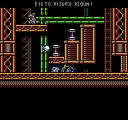
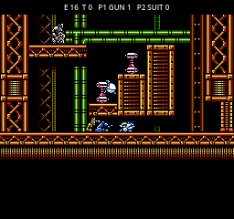
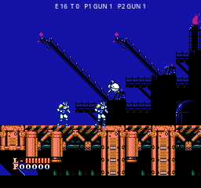

# PB3: геометрия, препятствия и два игрока — 2026-10-02

Продолжение проверки после сообщения о несовпадении фона с опорами и разном
поведении героев на чужих уровнях. Номера `p0.1` в журналах означают Power
Blade, stage 0, area 1; в игровом меню это STAGE 1, AREA 2. `s3.0` — Solbrain,
STAGE 4. Нумерация в технических журналах начинается с нуля.

## Реестр воспроизведённых ошибок

| ID | Ошибка и воспроизведение | Исправление и проверка |
|---|---|---|
| GEO-01 | Фон вертикальных областей PB2 не совпадает с коллизиями. Например `p0.1`, камера 0, 128, 224, 256: сотни неверных пикселей в выборке. | Отрисовка использует ту же адресацию страниц: 240 видимых строк в странице карты из 256 строк. Убрано лишнее смещение на 16 строк. Исправлены PB3 и обычный PB2. Независимая проверка декодирует исходный атлас по координатам столкновений. |
| GEO-02 | Второй Solbrain в родной игре рисовался со смещением: камера вычиталась дважды. Воспроизводилось во всех 20 этапах. | Координаты гостевого спрайта вычисляются от фактической позиции героя и экрана. Проверяются обе таблицы спрайтов, а не только наличие непустых пикселей. |
| GEO-03 | Нова на уровнях Solbrain выравнивался по сетке экрана вместо мировой сетки при вертикальной прокрутке. | При посадке и контакте с потолком учтено вертикальное положение камеры. Регрессия в движущейся камере и проходах по карте. |
| GEO-04 | Нова не видел пол ниже строки 224 своего экрана на чужих уровнях (`s2`, `s3`, `s9`). | Для Solbrain запросы столкновений и поверхности больше не обрезаются границами интерфейса Power Blade. Проверки проходят через настоящий мировой переходник. |
| GEO-05 | Гостевые герои не получали твёрдые объекты PB2; платформа могла существовать только для родного героя. | Всем передаются прямоугольники объектов. Положение движущейся платформы учитывается отдельно для каждого гостя; движение первого игрока не копируется второму. Проверены стена, платформа вне сетки тайлов и движение платформы вверх/вправо. |
| GEO-06 | Одновременное «вниз + прыжок» у Новы запускало прыжок. Скольжение существовало только после предварительного приседания. | В PB3 сочетание запускает существующее скольжение и его родной кадр. Поведение отдельного NES-режима не меняется. |
| GEO-07 | Solbrain не мог проходить низкие коридоры PB2. | Добавлено скольжение с родными скоростями и проверками PB2; под потолком нельзя встать. Для низкой позы используется уменьшенный по высоте кадр приседания Solbrain и соответствующий контактный прямоугольник. Это временный вариант графики, не новая нарисованная анимация. |
| GEO-08 | Solbrain проходил грудью сквозь тонкую платформу при прыжке: `p1.1`, старт `(184,462)`, вправо с периодическим прыжком, кадр 93. | На чужих уровнях движение дополнительно проверяется всем корпусом с шагом не более пикселя. Родные два боковых пробника пропускали тонкую преграду между ними. |
| GEO-09 | В вертикальных PB2 Solbrain мог двигаться по 16 служебным строкам между страницами. | Для его движения используются непрерывные координаты; обращения к карте переводятся в адреса страниц. Переход применяется также к оружию и платформам. |
| GEO-10 | В переходниках были перепутаны вода и смертельная поверхность. PB2 terrain 4 считался смертельным, а вода Solbrain превращалась в PB2 terrain 2. | Таблица исправлена по фактическим веткам `Pb2Player._terrain`: 4 — вода, 2 — смертельная поверхность. Есть отдельные проверки обоих направлений. Устранена ложная смерть Solbrain в `p3.1`. |

Ошибки опубликованы в этом локальном реестре. Внешний трекер к проекту не подключён.

## Что именно проверяется

- **83 участка:** фон сравнивается с независимым декодированием исходных тайлов;
  вертикальные области проверяются при четырёх положениях камеры. Отдельно
  проверяется положение второго Solbrain на всех 20 родных уровнях.
- **47 проверок препятствий:** каждый герой в обоих слотах; стена, посадка на
  платформу вне сетки, перенос движущейся платформой, низкий проход, вода.
- **Четыре настоящих низких прохода:** `p0.1`, `p0.2`, `p2.2`, `p3.1`.
  Оба порядка героев, оба игровых слота. Успех фиксируется в момент достижения
  дальнего конца проверяемого отрезка живым героем: последующее падение за
  отрезком не выдаётся за ошибку скольжения.
- **Маршруты по геометрии:** до трёх распределённых точек на карту, два порядка
  героев и пять сценариев управления по 180 шагов. Это изолированная проверка
  карты без врагов; не объявляется полным прохождением игры. Координаты,
  количество шагов и исключения сохраняются в `docs/qa/traversal.json`.
- **Живые игровые сессии:** отдельный прежний стенд проверяет все 83 входа с
  шестью составами команды без бессмертия, смерти, переходы, лестницы и меню.
- Скриншоты низкого прохода сняты в настоящей сессии, с работающими врагами,
  без бессмертия. Проверены оба порядка героев.

В десяти записях (`p5.0`, `p6.1`…`p6.9`) сканер не нашёл подходящих статических
опор для этой выборки маршрутов. Они остаются в проверках отрисовки и живого
входа; динамические сцены и бои требуют отдельных сценариев. Это явно отмечено
нулём `sites`, а не скрытым успешным прохождением.

Полное прохождение каждого маршрута от входа до выхода, все боссы, особые
движущиеся сцены Solbrain и комбинации оружия/костюмов пока не доказаны.

## Итог последнего прогона

| Набор | Результат |
|---|---|
| Фон и положение спрайтов | 175 проверок, 0 ошибок |
| Препятствия, вода, четыре низких отрезка | 47 проверок, 0 ошибок |
| Выборочные маршруты | 2 190 сценариев, 370 750 шагов, 0 попаданий корпуса в твёрдый тайл |
| Живые входы | 498 запусков, 58 151 шаг без бессмертия, 59 493 проверки сессий без ошибок |
| Прежний стенд чужих уровней | 5 185 проходов, 0 расхождений |
| Прежний стенд двух игроков | 2 460 проходов, 0 расхождений |
| Отрисовка PB3 | 8 проверок, 0 расхождений |
| Сборка macOS | 7 проверок экспортированной игры, 0 расхождений |
| Нова против NES | 9 сценариев в трёх областях, 3 199 кадров совпали |
| Solbrain против NES | 8 сценариев на обычной поверхности и в воде, 0 расхождений |

Журнал: `docs/qa/geometry-checks.txt`. Полный старый набор проверки Solbrain
был прерван перед следующим исправлением исходников; в итог засчитан только
завершённый адресный прогон восьми сценариев. Старый тест лестницы ссылался на
переименованный приватный метод; ссылка обновлена, затем весь набор живых
сессий пройден заново. Обёртка считает ошибки GDScript провалом даже при коде
выхода Godot 0.

## Воспроизведение

```sh
# Пиксели, препятствия, выборочные маршруты, свежие скриншоты
python3 work/extract/verify_pb3_geometry.py --capture

# Быстрая проверка отрисовки и конкретных препятствий
python3 work/extract/verify_pb3_geometry.py --quick

# Все составы команды и живые входы
python3 work/extract/verify_pb3_session.py
```

Скольжение: P1 — **↓ + X**, P2 — **S + '**. Удерживать вниз, пока проходите
под потолком. У Solbrain эта возможность добавлена на уровнях Power Blade;
в его родных уровнях сохраняются родные действия. Лестница — вверх/вниз.

## Изображения




